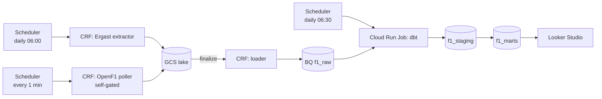

# F1 GCP Pipeline — Build Plan

## Project summary
End-to-end GCP data pipeline that ingests Formula 1 race-weekend data from two free public APIs, models it into an analytics-ready warehouse, and serves a Looker Studio dashboard. **Daily batch** for canonical results (Ergast); **1-minute micro-batch poller** for live telemetry during sessions (OpenF1, self-gated).

## Architecture

## Pipeline-type rationale
**Hybrid: daily batch + 1-minute micro-batch during live sessions.** Ergast (canonical, updates once per race weekend) is polled once a day at 06:00 — polling more often would waste calls. OpenF1 (live telemetry, only meaningful during sessions) is polled every minute, but the function self-gates: if no session is active, it returns 204 immediately and costs almost nothing. Both sources land in the same lake under the same conventions, so downstream is uniform. **This is honest "micro-batch," not "streaming"** — Cloud Scheduler polling is not Pub/Sub or Dataflow, and the README will say so.

## GCP constants

| Setting | Value |
|---|---|
| Project ID | `image-lab-494712` |
| Region | `us-central1` |
| GCS lake bucket | `image-lab-f1-lake` |
| BQ datasets | `f1_raw`, `f1_staging`, `f1_marts` |
| BQ location | `US` |
| Daily batch schedule | `0 6 * * *` Europe/Madrid |
| OpenF1 poll schedule | `*/1 * * * *` UTC |
| dbt schedule | `30 6 * * *` Europe/Madrid |

Service accounts (least privilege):
- `f1-extractor-sa` — GCS write only on `image-lab-f1-lake/raw/*`.
- `f1-loader-sa` — GCS read on lake; BQ load into `f1_raw`.
- `f1-dbt-sa` — BQ read raw; write `f1_staging` and `f1_marts`.

## Roles

| Who | Owns |
|---|---|
| **Misha** | GCP console actions (anything that costs money, creates resources, or touches IAM); scope and naming decisions; building dashboards in Looker Studio; running every deploy script; final submission. |
| **Claude** | Writing code, configs, SQL, README, and CI; drafting deploy scripts (Misha runs them); explaining trade-offs; preparing snippets and instructions; reviewing output and suggesting fixes. |
| **Both** | Sanity-checking outputs after each phase. |

---

# TIER 1 — must-ship (covers the full rubric)

After Phase 8 the project is rubric-complete and could be submitted as-is.

## Phase 0 — One-time GCP setup
**Functionality:** the platform exists. APIs enabled, lake bucket created, BQ datasets exist, three least-privilege service accounts exist, local dev is authenticated.
**You:** run the setup commands, confirm billing is on, verify resources in the console.
**Me:** prepare the exact command list and explain what each one does and why; document the chosen IAM roles.
**Done when:** datasets, bucket, and service accounts are visible in the console with the documented roles attached.

## Phase 1 — Repo scaffolding
**Functionality:** the project layout exists; nothing runs yet but every folder has a place to put things. Git initialised, `.gitignore` in place, README shell ready to fill in.
**You:** approve the layout, run the scaffolding commands locally.
**Me:** generate the directory tree, the gitignore, and a README skeleton that mirrors the architecture.
**Done when:** `tree -L 3` matches the layout in CLAUDE.md and the first commit is in.

## Phase 2 — Ergast extractor
**Functionality:** an HTTP-triggered Cloud Run Function that, on each invocation, calls the Ergast API for a configurable list of endpoints (results, drivers, qualifying, standings, races) and writes one NDJSON file per page to GCS at the documented path. Idempotent (filenames include UTC timestamp, never overwrites). Configurable via env vars only.
**You:** run the local smoke test, run the deploy script, confirm files appear in GCS.
**Me:** write the extractor code, requirements, deploy script, and a per-component README; explain how to run it locally.
**Done when:** invoking the deployed function writes NDJSON under `raw/source=ergast/endpoint=*/dt=*/`.

## Phase 3 — Loader (GCS → BigQuery)
**Functionality:** an Eventarc-triggered Cloud Run Function that fires whenever a new file lands in the lake. Parses the file's path to figure out which table it belongs to, loads it into `f1_raw.{source}_{endpoint}` with `WRITE_APPEND`, uses an explicit schema if one exists in the repo (autodetect only on first load). Bad files get moved to `raw_quarantine/` and the function fails loudly so monitoring catches it.
**You:** deploy it, drop a test file, check that rows appear in BQ; later, after the first good load, dump the autodetected schemas to disk and commit them.
**Me:** write the loader code, the path-parser logic, the quarantine handling, and the deploy script; explain when and how to commit explicit schemas.
**Done when:** a known-good file results in BQ rows; a malformed file ends up in quarantine.

## Phase 4 — Scheduling (Ergast)
**Functionality:** Cloud Scheduler invokes the Ergast extractor once a day at 06:00 Europe/Madrid using OIDC auth. Manual trigger seeds the lake on day one.
**You:** run the create-schedulers script, manually trigger the first run.
**Me:** write the script, explain the cron and the OIDC setup.
**Done when:** Scheduler shows a green run and `f1_raw.*` has rows.

## Phase 5 — dbt: staging + 3 marts
**Functionality:** the warehouse layer. Staging views type-cast and dedupe the raw JSON for each Ergast endpoint. Three marts power the Tier 1 dashboard:
- `dim_driver` — one row per driver with their latest team.
- `dim_race` — one row per race weekend.
- `fct_driver_race_summary` — one row per driver-per-race with finishing position, grid, points, status. **This is the dashboard's main fact table.**

Every model has a `schema.yml` entry with column descriptions, `unique`+`not_null` on natural keys, and a referential-integrity test linking the fact to the driver dim.
**You:** install dbt locally, copy the example profile, run `dbt build` once and confirm it's green.
**Me:** write `dbt_project.yml`, profile example, all SQL models, and the schema.yml tests; explain the staging→marts pattern.
**Done when:** `dbt build` exits 0 and the three marts are populated for the current and prior season.

## Phase 6 — dbt runner in production
**Functionality:** a Cloud Run Job (containerised dbt) that runs `dbt build` on a daily schedule, 30 minutes after Ergast lands. This is what keeps the warehouse fresh in prod without touching local machines.
**You:** run the build/deploy script (Cloud Build + deploy + scheduler), confirm the job runs green.
**Me:** write the Dockerfile, entrypoint, profile-for-prod, deploy script, and the scheduler entry.
**Done when:** the job runs on its own schedule and `f1_marts` updates daily.

## Phase 7 — Dashboard (one page)
**Functionality:** a single Looker Studio page ("Season overview") with: a championship table, a points-over-rounds line chart, and a teammate H2H matrix. Reads only from `f1_marts`. Public-view link.
**You:** build the dashboard in Looker Studio (this is a UI task, not code), set sharing, paste the link into README.
**Me:** sketch which charts go where, define the calculated fields needed for teammate H2H, and review the result.
**Done when:** the link opens in incognito and the numbers sanity-check against the Ergast website.

## Phase 8 — CI + grader-facing README
**Functionality:** every PR runs `ruff` on Python and `dbt parse` (or `dbt build` against committed seed fixtures) so the project doesn't silently break. The top-level `README.md` is rewritten for a *human grader*: problem statement, architecture diagram, "reproduce in 5 commands," dashboard link, screenshot, limitations, and the 6-char commit ID slot.
**You:** open a test PR to verify CI works; review the README for clarity.
**Me:** write the workflow YAML, the seed fixtures, and the full README content.
**Done when:** PR CI is green and the README is grader-ready.

### 🛑 SHIP CHECKPOINT 1 — rubric-complete. Could submit today.

---

# TIER 2 — strong submission (only if Tier 1 ships ≥1 week early)

## Phase 9 — OpenF1 micro-batch poller
**Functionality:** a second Cloud Run Function, scheduled every minute. It first asks OpenF1 whether any session is currently active (a cheap call) — if not, it returns 204 immediately and costs almost nothing. If a session *is* active, it pulls new laps since a high-water-mark stored in GCS and writes them to the lake. This is what gives the project "live data" without ever touching streaming infrastructure.
**You:** deploy the function, schedule it, watch one live session in the console (or wait for one).
**Me:** write the poller, the HWM logic, the deploy + schedule script; explain the self-gating idea so you can defend it in the presentation.
**Done when:** during a live session, `f1_raw.openf1_laps` grows by ~1 row/car/minute and the function 204s outside sessions.

## Phase 10 — `fct_lap` + simple pace metric
**Functionality:** OpenF1 laps flow into `f1_raw` → staging view → `fct_lap` (incremental, lap-grain). On top of that, `fct_driver_pace` computes each driver's median lap-time-percentile vs. the field median per stint. This is a simple, defensible "who was fast" metric — *not* the full clean-air model. dbt tests check non-null lap times and that every driver number resolves to a real driver.
**You:** kick off the next dbt run, sanity-check the numbers against a public race recap.
**Me:** write the staging and mart SQL plus tests; explain why the simple metric is enough for Tier 2.
**Done when:** `fct_driver_pace` is populated for the most recent race and the numbers look plausible.

## Phase 11 — Monitoring + freshness
**Functionality:** the project notices when something's broken. A Cloud Monitoring alert policy emails you when any Cloud Run Function logs an ERROR for 10 minutes. dbt's `source freshness` check warns if Ergast hasn't loaded in 36h, errors at 72h. Both are wired into the daily run, and screenshots go in the README under "Best Practices → Monitoring."
**You:** set up an email notification channel, deploy the alert policy, intentionally break something to confirm the alert fires.
**Me:** write the alert policy YAML, the freshness config, and the README section.
**Done when:** a forced error in a CRF triggers the alert email within ~10 min.

## Phase 12 — Dashboard page 2 (race deep-dive)
**Functionality:** a second Looker Studio page parameterised by race selector. Three charts: position-over-laps line chart, pace ranking bar chart, and a race summary table. All three update when the user picks a different race.
**You:** build the page, configure the parameter, paste a screenshot into README.
**Me:** specify which fields drive which chart and how the parameter wires through.
**Done when:** changing the race selector updates all three charts.

### 🛑 SHIP CHECKPOINT 2 — strong submission with live data + monitoring + 2 dashboard pages.

---

# TIER 3 — polish (only if everything's done and you have time)

## Phase 13 — Full clean-air pace
**Functionality:** the headline metric from the original spec. Three more staging models (stints, weather, race control) plus `fct_clean_air_pace` — per-driver per-compound median lap time, computed only on laps that pass a documented "clean-air" filter (gap-ahead > 1.5s, not in/out lap, no SC/VSC active) with a linear fuel correction subtracted. The clean-air definition is documented in the model's `description` field so a sharp grader can read it.
**You:** decide whether the trade-off is worth it (real risk: spending 2–3 days here for a metric a grader may not appreciate); review the heuristic.
**Me:** implement the staging + the mart, document the heuristic, propose a sanity-check vs. known clean-air laps from a recent race.
**Done when:** `fct_clean_air_pace` produces sane per-compound rankings and is the headline KPI on the dashboard.

## Phase 14 — Live page + off-season replay
**Functionality:** dashboard page 3 showing current gaps, predicted finishing order, tire age, labelled "delayed by ~2 min." Plus an off-season replay Cloud Run Job that re-publishes a stored historical race into a `_replay` dataset on a 1-min cadence so the page always has *something* to show during a demo.
**You:** decide if this is worth the time; build the page; pick which historical race to replay.
**Me:** scope the replay job and the dashboard page; warn about the lag honestly.
**Done when:** the page works during a real session OR the replay drives it convincingly during a demo.

## Phase 15 — Submission
**Functionality:** the project is handed in. Final lint, final dbt build, scheduler smoke-test, README with final dashboard link + screenshot, commit pushed, 6-char commit ID captured.
**You:** push to GitHub, copy the commit ID, submit the form.
**Me:** run a final pre-flight checklist; review README; flag anything missing.
**Done when:** course form has been submitted with repo URL, commit ID, and dashboard link.

---

## Critical files (built across phases)
- `README.md` — Phase 1 shell, Phase 8 grader-ready.
- `extractors/ergast/` — Phase 2.
- `loaders/gcs_to_bq/` (+ `schemas/`) — Phase 3.
- `deploy/*.sh` — phases 2, 3, 4, 6, 9.
- `dbt/` (project, profile, models, schema.yml, seeds) — phases 5, 8, 10, 13.
- `dbt_runner/` (Dockerfile, entrypoint, prod profile) — Phase 6.
- `extractors/openf1/` — Phase 9.
- `infra/alerts/` — Phase 11.
- `.github/workflows/ci.yml` — Phase 8.

## How we know we're on track
- After Tier 1 (Phase 8), the project already passes the rubric. Anything beyond is upside.
- After every phase, both of us run the acceptance check before moving on. No phase is "done" because the code looks right — only because the verification command produced the expected result.
- If a Tier 2 or Tier 3 phase blows past 1 day, drop it and ship what you have.

## Limitations to document in README
- OpenF1 is community-run; mid-session outages possible. Ergast recovers history afterward.
- Pace correction is a linear approximation, not real telemetry.
- The "live" page is delayed ~2 minutes by polling cadence + Looker refresh.
- Off-season: a replay job re-plays a past GP for demo purposes.

## Out-of-scope (deliberate, mention in README)
- Pub/Sub / Dataflow streaming — overkill for the rubric, not justifiable on cost.
- Composer / Airflow — Cloud Scheduler is sufficient.
- Terraform — gcloud scripts are enough for a course project.
