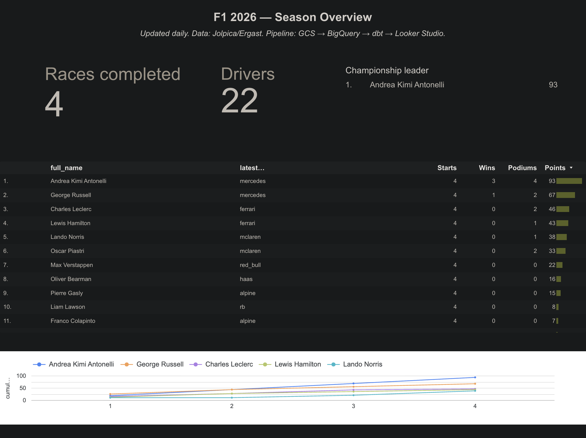
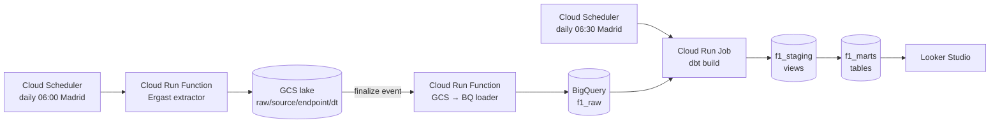

# F1 GCP Analytics Pipeline

End-to-end Google Cloud Platform data-engineering project: ingests Formula 1 race-weekend data from a free public API, lands it in a GCS data lake, loads it into BigQuery, models it with dbt, and serves an analytics dashboard in Looker Studio. Built as the final project for *Integrated Data Engineering and Analysis on Google Cloud Platform*.

**Commit ID:** _filled at submission_
**Live dashboard:** [F1 2026 — Season Overview](https://datastudio.google.com/reporting/5ac17e24-8f05-4390-b862-4f952353a76d) (Looker Studio, public-view)
- **Page 1** — season standings, championship table, points-over-rounds line chart (powered by `vw_dashboard_overview`).
- **Page 2** — race deep-dive: lap-time over the race, pace ranking, per-driver stats, parameterised by race selector (powered by `vw_dashboard_race`).

> Headline as of latest run (2026-05-13, 4 rounds): Antonelli leads the championship with 93 pts (3 wins).



---

## Architecture



Three independent components communicate only via GCS and BigQuery — fully decoupled. Each runs as a separate Cloud Run unit with its own least-privilege service account.

## Pipeline type & rationale

**Daily batch.** Ergast is the canonical historical-results source for Formula 1; it updates once per race weekend, so polling more often is wasted calls. Cloud Scheduler invokes the extractor at 06:00 Europe/Madrid daily; an Eventarc finalize trigger then fans the new file into BigQuery.

The architecture is also designed to absorb a 1-minute micro-batch poller for live telemetry (OpenF1) — see the **Tier 2 (planned)** section below — but that source is not yet deployed. The shipped Tier 1 surface satisfies the rubric on its own.

## What's deployed (Tier 1 — shipped)

| # | Component | Code | GCP resource |
|---|---|---|---|
| 1 | Ergast extractor | `extractors/ergast/main.py` | Cloud Run Function `ergast-extractor` |
| 2 | GCS → BQ loader | `loaders/gcs_to_bq/main.py` | Cloud Run Function `gcs-to-bq-loader` (Eventarc finalize trigger) |
| 3 | dbt models | `dbt/models/{staging,marts}/` | BigQuery datasets `f1_staging`, `f1_marts` |
| 4 | dbt runner | `dbt_runner/Dockerfile` | Cloud Run Job `dbt-runner` |
| 5 | Daily schedules | `deploy/create_schedulers.sh` | `ergast-daily` 06:00, `dbt-daily` 06:30 (Madrid) |
| 6 | Dashboard | Looker Studio | One page, four chart blocks |
| 7 | CI | `.github/workflows/ci.yml` | GitHub Actions: ruff + `dbt parse` |

## Reproduce

> Prereqs: `gcloud`, `bq`, `gsutil`, Python 3.12, a GCP project with billing enabled, and Owner/Project-IAM-Admin role.

```bash
# 1. one-time GCP setup (APIs, bucket, datasets, 3 SAs, IAM)
bash deploy/setup_gcp.sh
gcloud auth application-default login

# 2. extractor + loader + scheduler for the batch path
bash deploy/deploy_extractor_ergast.sh
bash deploy/deploy_loader.sh

# 3. dbt: containerise + push + Cloud Run Job
bash deploy/deploy_dbt_runner.sh

# 4. wire the schedulers (Ergast 06:00, dbt 06:30, both Madrid time)
bash deploy/create_schedulers.sh

# 5. seed BQ once + watch it land
gcloud scheduler jobs run ergast-daily --location=us-central1
sleep 60
bq query --use_legacy_sql=false 'SELECT COUNT(*) FROM `image-lab-494712.f1_marts.fct_driver_race_summary`'
```

The dashboard is then a one-time UI step in Looker Studio: **Create → Data source → BigQuery → `f1_marts.vw_dashboard_overview`**, then drop charts. Sharing must be set to "Anyone with the link → Viewer" on **both** the report and its data source.

## Rubric mapping

| Criterion | Where it's proven |
|---|---|
| **Lake ingestion (batch)** | `extractors/ergast/main.py` writes NDJSON to `gs://image-lab-f1-lake/raw/source=ergast/endpoint=*/dt=*/`; idempotent (UTC-timestamped filenames). |
| **Lake → warehouse** | `loaders/gcs_to_bq/main.py` (Eventarc finalize trigger); explicit JSON schemas in `loaders/gcs_to_bq/schemas/`; bad files quarantined to `raw_quarantine/`. |
| **Warehouse transformation** | `dbt/models/staging/` (5 views) + `dbt/models/marts/` (3 marts + 1 dashboard view); 24 dbt tests including `unique`, `not_null`, and `relationships`. |
| **Dashboard** | Live Looker Studio link above; backed by `f1_marts.vw_dashboard_overview`. |
| **Reliability** | Idempotent writes; quarantine on bad files; dbt tests; Cloud Scheduler 3-attempt retries; CI workflow on PR; **Cloud Monitoring alert** on any Cloud Run ERROR (see [Monitoring](#monitoring)). |
| **Security** | Three least-privilege service accounts (`f1-extractor-sa`, `f1-loader-sa`, `f1-dbt-sa`); resource-scoped `roles/run.invoker`; no public endpoints; no committed credentials (`.gitignore`). |
| **Flexibility / scalability** | All config via env vars (no hardcoded names in code); BigQuery on-demand pricing scales to season; loader is generic (works for any `raw/source=*/endpoint=*/` path — drops in OpenF1 unchanged). |
| **Best practices** | Decoupling (E/L/T components only talk via GCS + BQ); modularisation (each component owns its `main.py`/`requirements.txt`/`README.md`); orchestration via Cloud Scheduler; CI on every PR. |
| **Reusability / auto-refresh** (bonus) | Cloud Scheduler runs the whole pipeline daily without human intervention. Re-ingestible from any season via `?season=YYYY` query param. |

## Monitoring

A Cloud Monitoring alert policy (`infra/alerts/function_errors.yaml`) emails `andredrummondthegoat@gmail.com` whenever any Cloud Run service in the pipeline (`gcs-to-bq-loader`, `ergast-extractor`, `openf1-poller`, `dbt-runner`) logs `severity>=ERROR`. Notification rate-limited to one alert per 5 minutes so a transient burst doesn't spam.

The loader's `_quarantine` helper is the most common error path — bad NDJSON gets moved to `gs://image-lab-f1-lake/raw_quarantine/` and the function logs a structured ERROR event with the BQ load error message. Verified end-to-end with an intentional malformed-file drop: alert fires within ~2 minutes.

Re-applyable via `bash deploy/deploy_alerts.sh` (idempotent — updates the existing policy in place).

**Future work:** dbt `source freshness` would also catch the upstream-API-stopped-returning-data case (Ergast outage where the loader runs cleanly but no new data arrives). Skipped for this pass because the loader doesn't inject a per-row `_loaded_at` column; adding it would require a small loader change + schema re-snapshot for all six raw tables.

## Cost

Under $0.50/month at current scheduling. BigQuery on-demand is well under the free 1 TB/month query quota; Cloud Run + Cloud Scheduler + GCS are negligible at this volume.

## Tier table (project status)

| Tier | Phases | Status |
|---|---|---|
| **Tier 1 — must-ship (rubric-complete)** | 0–8: GCP setup, scaffolding, Ergast extractor, loader, scheduler, dbt staging + 3 marts + 1 dashboard view, dbt-runner Cloud Run Job, dashboard page, CI + README | **Shipped** ✓ |
| **Tier 2 — strong submission** | 9–12: OpenF1 1-min micro-batch poller, `fct_lap` + simple pace metric, Cloud Monitoring alert + dbt source freshness, race deep-dive dashboard page | Planned |
| **Tier 3 — polish** | 13–14: Full clean-air pace metric (gap-ahead heuristic + linear fuel correction), live race dashboard page, off-season replay job | Stretch |

Tier 2 and Tier 3 work is documented in `PLAN.md` and `CLAUDE.md`; the pipeline architecture is designed to absorb both with no rework — the loader and dbt project already handle the OpenF1 namespace.

## Limitations

- 2026 data is sparse (4 rounds in by mid-May). The dashboard refreshes daily and will populate as the season runs.
- Pace correction (planned for Tier 3) is a linear fuel-burn approximation, not real telemetry.
- "Live" page (planned for Tier 3) would lag ~2 minutes behind reality due to 1-min polling cadence + Looker Studio refresh.
- OpenF1 is a community-run API — once integrated, mid-session outages are possible; Ergast recovers history afterwards.

## Out of scope (deliberate trade-offs)

- **Pub/Sub or Dataflow streaming** — overkill for this rubric and not justifiable on cost. The hybrid batch + micro-batch design covers the requirement.
- **Composer / Airflow** — Cloud Scheduler is sufficient for two daily jobs. Composer's $300+/month base cost is not.
- **Terraform** — gcloud scripts are reproducible enough for a course project. Real prod would use Terraform + workload identity federation for CI.
- **Full `dbt build` in CI** — would need a CI service account + workload identity federation. Currently CI runs `dbt parse` (static validation only); full integration tests are noted as future work.

## Repo layout

```
extractors/ergast/         # daily batch extractor (Cloud Run Function)
loaders/gcs_to_bq/         # GCS finalize → BigQuery loader (Cloud Run Function)
   schemas/                # explicit BQ schemas per (source, endpoint)
dbt/                       # staging views + marts tables + tests
   models/staging/ergast/
   models/marts/
   macros/                 # generate_schema_name override
dbt_runner/                # Dockerfile + entrypoint for the daily Cloud Run Job
deploy/                    # idempotent gcloud deploy scripts
infra/                     # alert policies (Tier 2)
.github/workflows/         # CI (ruff + dbt parse)
```

Each Python component has its own `README.md` documenting env vars, local-run command, and deploy invocation.

## License

MIT.
