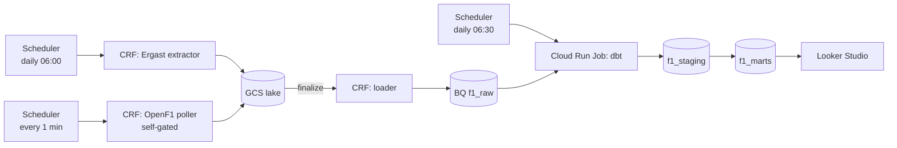

# F1 GCP Analytics Pipeline

End-to-end GCP pipeline that ingests Formula 1 race-weekend data from two free public APIs, models it into an analytics-ready warehouse, and serves a Looker Studio dashboard.

**Commit ID:** _filled at submission_
**Dashboard:** _filled at Phase 7_

## Overview

The pipeline runs on GCP entirely on managed services:

- **Daily batch** pulls canonical race results from the Jolpica/Ergast API.
- **1-minute micro-batch poller** pulls live laps from OpenF1 during sessions (self-gates when no session is active, so it costs almost nothing off-weekend).
- Both feed into a GCS lake, then BigQuery `f1_raw`, then dbt models into `f1_staging` and `f1_marts`.
- A Looker Studio dashboard reads only from `f1_marts`.

Course rubric mapping: lake ingestion ✓, lake→warehouse ✓, transformations ✓, dashboard ✓, security (least-privilege SAs) ✓, reliability (idempotent writes, dbt tests, CI) ✓, reusability (auto-refresh via Scheduler) ✓.

## Architecture

## Reproduce

> Requires gcloud, bq, gsutil, Python 3.11, and a GCP project with billing on.

1. One-time GCP setup: `bash deploy/setup_gcp.sh`
2. Authenticate locally: `gcloud auth application-default login`
3. Deploy extractors and loader: `bash deploy/deploy_extractor_ergast.sh && bash deploy/deploy_loader.sh` _(Phase 2/3)_
4. Deploy dbt runner: `bash deploy/deploy_dbt_runner.sh` _(Phase 6)_
5. Create schedulers: `bash deploy/create_schedulers.sh` _(Phase 4)_

Dashboard link is set in Looker Studio (Phase 7).

## Layout

| Path | Purpose |
| --- | --- |
| `extractors/ergast/` | Daily batch HTTP-triggered Cloud Run Function (Ergast → GCS). |
| `extractors/openf1/` | 1-minute self-gated poller (OpenF1 → GCS). |
| `loaders/gcs_to_bq/` | Eventarc-triggered loader (GCS → BigQuery `f1_raw`). |
| `dbt/` | Staging views + marts tables. Powers the dashboard. |
| `dbt_runner/` | Container image + entrypoint for the daily dbt Cloud Run Job. |
| `infra/alerts/` | Cloud Monitoring alert policies (YAML). |
| `deploy/` | gcloud-based deploy scripts; idempotent. |
| `.github/workflows/` | CI (ruff + dbt parse on PR). |

## Limitations

- OpenF1 is community-run; mid-session outages are possible. Ergast recovers history afterwards.
- Pace correction is a linear approximation, not real telemetry.
- The "live" dashboard page is delayed ~2 minutes by polling cadence + Looker refresh.
- Off-season: a replay job re-plays a past Grand Prix to keep the live page populated for demos.

## Out of scope (deliberate)

- Pub/Sub or Dataflow streaming — not needed for the rubric, not justifiable on cost.
- Composer/Airflow — Cloud Scheduler is sufficient.
- Terraform — gcloud scripts are enough for a course project.

## License

MIT (or whatever the course requires; update before submission).
