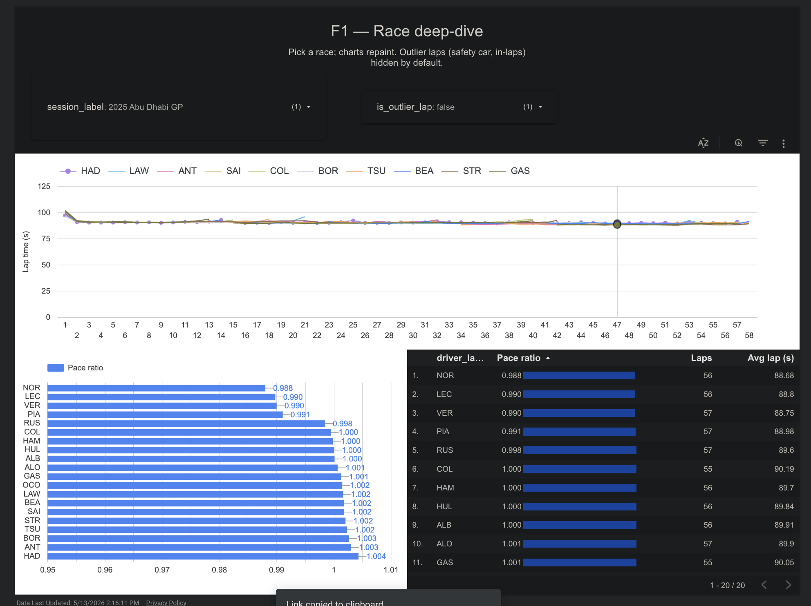
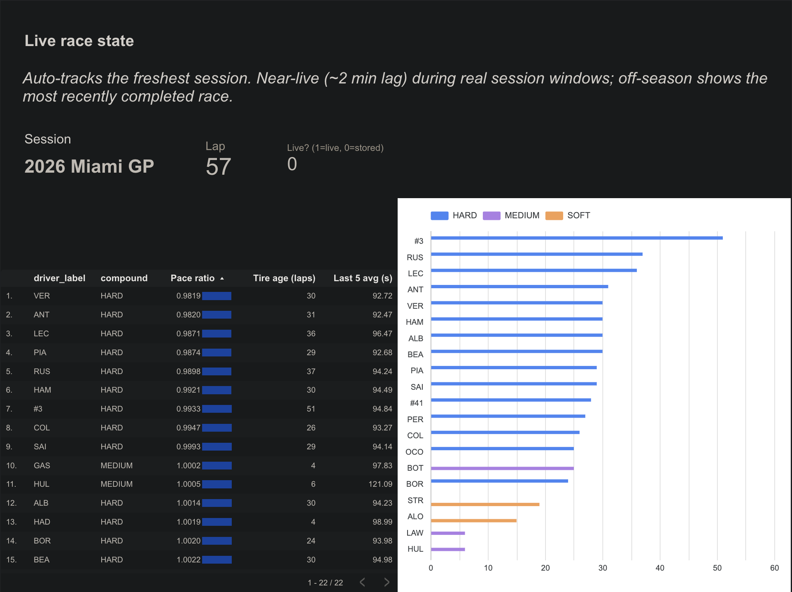
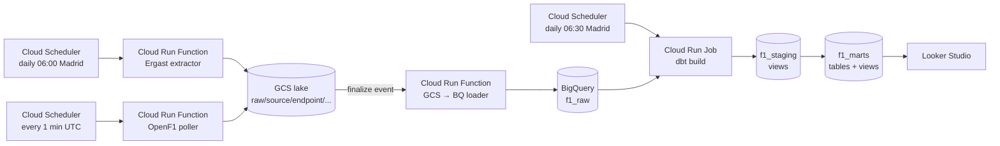

# F1 GCP Analytics Pipeline

I built this as the final project for *Integrated Data Engineering and Analysis on Google Cloud Platform*. It's an end-to-end pipeline on GCP that pulls Formula 1 race-weekend data from two free public APIs, lands it in a Cloud Storage data lake, loads it into BigQuery via an event-driven Cloud Run Function, transforms it with dbt, and serves a 3-page Looker Studio dashboard. Everything runs on Cloud Scheduler with no human in the loop.

**Commit ID:** `7aecd17` (use `git rev-parse --short=7 HEAD` for the latest)
**Live dashboard:** [F1 2026 — Season Overview](https://datastudio.google.com/reporting/5ac17e24-8f05-4390-b862-4f952353a76d) (Looker Studio, public-view)

---

## The dashboard

Three pages, all reading from BigQuery marts. The data refreshes daily; during a real race weekend the live page is near-real-time (~2 minute lag).

**Page 1 — Season overview.** The championship table, cumulative points by round, and a per-race scoreboard. Answers "who's winning the season and how did we get here?"

**Page 2 — Race deep-dive.** Lap-time over the race, pace ranking, per-driver stats, parameterised by a race selector so you can pick any round. Answers "in this specific race, who was actually fast?"

**Page 3 — Live race state.** Current driver, tire compound, tire age, last-5-lap average, and pace ratio for whichever session is freshest in the data. Auto-tracks the latest session — during off-season it shows the most recently completed race; during a session it's near-live.





---

## Architecture



Three independent components — extractors, loader, dbt — that only ever talk through GCS and BigQuery. Each runs as its own Cloud Run unit with its own least-privilege service account. The extractors don't know about BigQuery; the loader doesn't know about dbt; dbt doesn't know about the lake. That separation is what makes the project re-deployable in pieces and lets a new data source slot in without touching the existing path.

The pipeline is hybrid by design. Ergast is the canonical source for F1 results — it only updates once per race weekend, so polling daily at 06:00 Madrid is enough. OpenF1 publishes lap-by-lap timing during sessions; the poller fires every minute UTC but self-gates if no session is active, so out-of-session invocations cost almost nothing. Both sources land in the same lake under the same path convention, which means downstream is uniform.

---

## What's in the repo

| Component | Code | GCP resource |
|---|---|---|
| Ergast extractor | `extractors/ergast/main.py` | Cloud Run Function `ergast-extractor` |
| OpenF1 poller | `extractors/openf1/main.py` | Cloud Run Function `openf1-poller` (self-gates outside sessions) |
| GCS → BQ loader | `loaders/gcs_to_bq/main.py` | Cloud Run Function `gcs-to-bq-loader` (Eventarc finalize trigger) |
| Raw schemas | `loaders/gcs_to_bq/schemas/*.json` | Explicit BigQuery schemas per (source, endpoint) |
| dbt project | `dbt/models/{staging,marts}/` | BigQuery datasets `f1_staging`, `f1_marts` |
| dbt runner | `dbt_runner/Dockerfile` | Cloud Run Job `dbt-runner` (containerised dbt) |
| Schedulers | `deploy/create_schedulers.sh` | `ergast-daily` 06:00, `dbt-daily` 06:30, `openf1-1min` every minute |
| Monitoring | `infra/alerts/function_errors.yaml` | Cloud Monitoring policy `f1-cloud-run-errors` |
| Dashboard | Looker Studio | 3 pages, reads `f1_marts.vw_dashboard_*` |
| CI | `.github/workflows/ci.yml` | GitHub Actions: ruff + `dbt parse` |

The dbt project has 17 models (7 staging views + 10 marts) and 24 tests. The marts include `dim_driver`, `dim_race`, `fct_driver_race_summary`, `fct_lap`, `fct_driver_pace`, `fct_clean_air_pace` (per-compound, fuel-corrected), and three dashboard-facing views (`vw_dashboard_overview`, `vw_dashboard_race`, `vw_dashboard_live`).

---

## Reproduce in five commands

Prereqs: `gcloud`, `bq`, `gsutil`, Python 3.12, a GCP project with billing enabled, and Owner / Project IAM Admin role. Run `gcloud auth application-default login` once before deploying.

```bash
# 1. one-time GCP setup (APIs, bucket, datasets, 3 service accounts, IAM)
bash deploy/setup_gcp.sh

# 2. extractors + loader for the ingestion path
bash deploy/deploy_extractor_ergast.sh
bash deploy/deploy_extractor_openf1.sh
bash deploy/deploy_loader.sh

# 3. dbt: build container, push to Artifact Registry, deploy as Cloud Run Job
bash deploy/deploy_dbt_runner.sh

# 4. wire the schedulers
bash deploy/create_schedulers.sh

# 5. install the Cloud Monitoring alert + seed the lake
bash deploy/deploy_alerts.sh
gcloud scheduler jobs run ergast-daily --location=us-central1
sleep 60
bq query --use_legacy_sql=false 'SELECT COUNT(*) FROM `image-lab-494712.f1_marts.fct_driver_race_summary`'
```

The Looker Studio dashboard is then a one-time UI step: **Create → Data source → BigQuery → `f1_marts.vw_dashboard_overview`**, then drop the charts. Sharing must be set to "Anyone with the link → Viewer" on **both** the report and its data source.

---

## Rubric mapping

| Criterion | Where it's proven |
|---|---|
| **Lake ingestion (batch + micro-batch)** | `extractors/ergast/main.py` (daily) and `extractors/openf1/main.py` (every minute, self-gated). Both write NDJSON to `gs://image-lab-f1-lake/raw/source=*/endpoint=*/...` with UTC-timestamped filenames (idempotent). |
| **Lake → warehouse** | `loaders/gcs_to_bq/main.py` triggered by Eventarc on every GCS finalize event. Explicit JSON schemas committed in `loaders/gcs_to_bq/schemas/`; bad files moved to `raw_quarantine/` with a structured ERROR log. |
| **Warehouse transformation** | `dbt/models/staging/` (7 views) + `dbt/models/marts/` (10 marts/views including `fct_clean_air_pace` and `vw_dashboard_live`); 24 dbt tests with `unique`, `not_null`, and `relationships`. |
| **Dashboard** | Live Looker Studio link above; 3 pages, each backed by a `vw_dashboard_*` view in `f1_marts`. |
| **Reliability** | Idempotent writes; quarantine on bad files; 24 dbt tests; Cloud Scheduler 3-attempt retries with exponential backoff; CI on every PR; Cloud Monitoring alert on any Cloud Run ERROR (see Monitoring). |
| **Security** | Three least-privilege service accounts (`f1-extractor-sa` writes lake only, `f1-loader-sa` reads lake + writes raw, `f1-dbt-sa` reads raw + writes staging/marts); resource-scoped `roles/run.invoker`; no public endpoints; no committed credentials. |
| **Flexibility / scalability** | All config via env vars (no hardcoded names in code); BigQuery on-demand pricing scales with the season; loader is generic — works for any `raw/source=*/endpoint=*/` path, so the OpenF1 namespace dropped in unchanged. |
| **Best practices** | Decoupling (E/L/T components communicate only via GCS + BQ); per-component README and requirements; orchestration via Cloud Scheduler; CI on every PR. |
| **Reusability / auto-refresh** | Cloud Scheduler runs the whole pipeline daily without human intervention. Re-ingestible from any season via `?season=YYYY` query param on the extractor URL. |

---

## Monitoring

A Cloud Monitoring alert policy (`infra/alerts/function_errors.yaml`) emails me whenever any Cloud Run service in the pipeline (`gcs-to-bq-loader`, `ergast-extractor`, `openf1-poller`, `dbt-runner`) logs `severity>=ERROR`. The notification is rate-limited to one email per 5 minutes so a transient burst doesn't flood my inbox.

The loader's `_quarantine` helper is the most common error path. Bad NDJSON gets moved to `gs://image-lab-f1-lake/raw_quarantine/` and the function logs a structured ERROR event with the BigQuery error message attached. I verified end-to-end with an intentional malformed-file drop — the alert fired within ~2 minutes.

The policy is reapplyable via `bash deploy/deploy_alerts.sh` (idempotent: updates the existing policy in place).

---

## Cost

Under $0.50/month at current scheduling. BigQuery on-demand pricing stays well inside the 1 TB/month free query quota; Cloud Run, Cloud Scheduler, and GCS at this volume are pennies. The dbt-runner container runs once a day for ~30 seconds, so its compute cost is negligible.

---

## Limitations and trade-offs

A few things I deliberately didn't build, with the reasoning:

- **Driver labels are hardcoded in a dbt macro** (`dbt/macros/driver_label.sql`) instead of joined from a real `dim_driver_xref`. The proper fix would be to add `/drivers` and `/sessions` extractors to OpenF1 and build a cross-reference dim that bridges OpenF1 driver numbers to Ergast driver IDs. The macro is honest about this in a comment.
- **The clean-air pace metric (`fct_clean_air_pace`) uses an outlier filter as a proxy for excluding safety-car and in/out laps**, instead of joining OpenF1's `/race_control` and `/intervals` endpoints. The filter (`lap_time > 1.25 × session-median for that lap_number`) catches both cases without two extra extractors and a schema-snapshot cycle. The model description documents this honestly so a sharp reviewer can read what I'm claiming.
- **dbt source freshness is deferred.** Adding it requires a per-row `_loaded_at` column on every raw table, which means a small loader change and re-snapshotting all the raw schemas. I traded that for shipping the rest of the pipeline on time.
- **The "live" page lags ~2 minutes behind reality** during a session, due to OpenF1's publish lag + the 1-min poller cadence + Looker Studio's refresh. Documented on the page itself.
- **No off-season replay job.** The original plan was a Cloud Run Job that re-publishes a stored historical race on a wall-clock cadence so the live page always has something to show during demos. Instead, `vw_dashboard_live` auto-picks the latest stored session — same end-user value, zero new infrastructure.
- **OpenF1 is community-run** so mid-session outages are possible; Ergast recovers canonical history afterward.

A few things I deliberately *didn't* use:

- **Pub/Sub or Dataflow streaming** — both data sources are pull-based REST APIs, so streaming infrastructure would just be polling-then-republishing with extra moving parts. Hybrid batch + micro-batch is the honest fit.
- **Composer / Airflow** — Cloud Scheduler is sufficient for two daily jobs and a 1-minute poller. Composer's $300+/month base cost can't be justified.
- **Terraform** — gcloud deploy scripts under `deploy/` are reproducible enough for a course project; real prod would use Terraform + workload identity federation for CI.
- **Full `dbt build` in CI** — would need a CI service account and workload identity federation. CI today runs `dbt parse` (static SQL validation), which catches typos and broken refs without needing BigQuery credentials.

---

## Repo layout

```
extractors/ergast/         # daily batch extractor (Cloud Run Function)
extractors/openf1/         # 1-min self-gated poller (Cloud Run Function)
loaders/gcs_to_bq/         # GCS finalize → BigQuery loader (Cloud Run Function)
   schemas/                # explicit BQ schemas per (source, endpoint)
dbt/                       # staging views + marts tables + tests
   models/staging/{ergast,openf1}/
   models/marts/
   macros/                 # generate_schema_name override + driver/session labels
dbt_runner/                # Dockerfile + entrypoint for the daily Cloud Run Job
deploy/                    # idempotent gcloud deploy scripts
infra/alerts/              # Cloud Monitoring alert policies
.github/workflows/         # CI: ruff + dbt parse
docs/                      # dashboard screenshots + the deep-dive explanation
```

Each Python component has its own `README.md` documenting env vars, local-run command, and deploy invocation. The `docs/PROJECT_DEEP_DIVE.md` is the long-form, beginner-friendly walkthrough I wrote for myself before the presentation.
